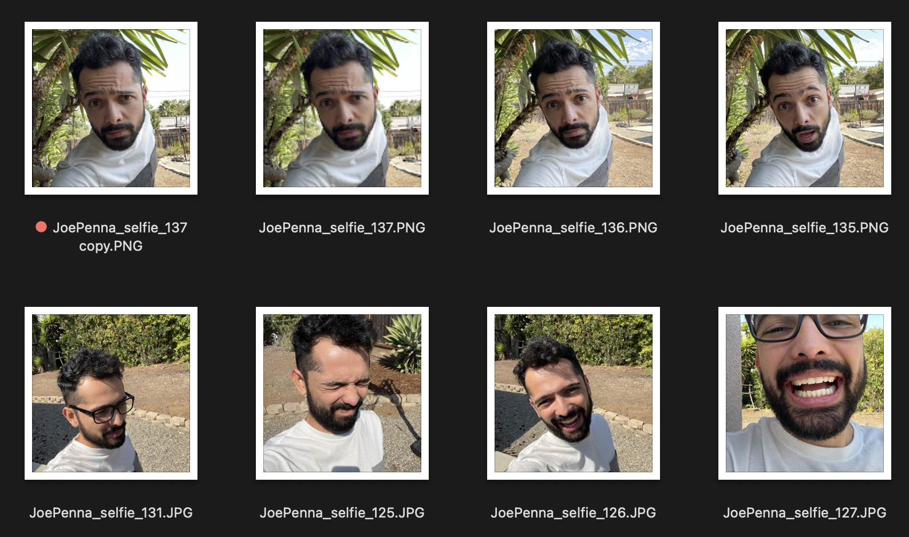
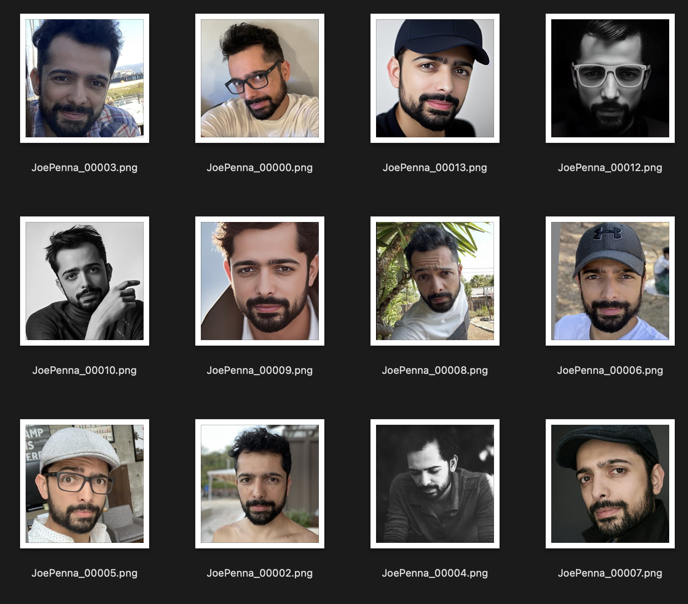

# Extended Dreambooth How-To Guides by Yushan
[For Running On Vast.ai](https://medium.com/@yushantripleseven/dreambooth-training-joepenna-on-vast-ai-5f1018239820)<br>
[For Running On Google Colab](https://medium.com/@yushantripleseven/dreambooth-training-joepenna-on-google-colab-63ec6e6cf050)<br>
[For Running On a Local PC (Windows)](https://medium.com/@yushantripleseven/dreambooth-training-joepenna-on-a-local-pc-windows-f00a4fd11dfd)<br>
[For Running On a Local PC (Ubuntu)](https://medium.com/@yushantripleseven/dreambooth-training-joepenna-on-a-local-pc-ubuntu-a2bf796430d2)<br>
[Adapting Corridor Digital's Dreambooth Tutorial To JoePenna's Repo](https://medium.com/@yushantripleseven/adapting-corridor-digitals-dreambooth-tutorial-to-joepenna-s-repo-d82bfbe0bfd2)<br>
[Using Captions in JoePenna's Dreambooth](https://medium.com/@yushantripleseven/using-captions-with-dreambooth-joepenna-dreambooth-716f5b9e9866)<br>

# Index

- [Notes by Joe Penna](#notes-by-joe-penna)
- [Setup](#setup)
  - [Easy RunPod Instructions](#easy-runpod-instructions)
  - [Vast.AI Setup](#vast-ai-setup)
  - [Run Locally](#running-locally)
    - [venv](#running-locally-venv)
    - [Conda](#running-locally-conda)
  - [Configuration File and Command Line Reference](#config-file-and-command-line-reference)
- [Captions & Multiple Subject/Concept Support](#captions-and-multi-concept)
- [Textual Inversion vs. Dreambooth](#text-vs-dreamb)
- [Using the Generated Model](#using-the-generated-model)
- [Debugging Your Results](#debugging-your-results)
  - [They don't look like you at all!](#they-dont-look-like-you)
  - [They sorta look like you, but exactly like your training images](#they-sorta-look-like-you-but-exactly-like-your-training-images)
  - [They look like you, but not when you try different styles](#they-look-like-you-but-not-when-you-try-different-styles)
- [Hugging Face Diffusers](#hugging-face-diffusers)

# The Repo Formerly Known As "Dreambooth"


## <a name="notes-by-joe-penna"></a>  Notes by Joe Penna
### **INTRODUCTIONS!**
Hi! My name is Joe Penna.

You might have seen a few YouTube videos of mine under *MysteryGuitarMan*. I'm now a feature film director. You might have seen [ARCTIC](https://www.youtube.com/watch?v=N5aD9ppoQIo&t=6s) or [STOWAWAY](https://www.youtube.com/watch?v=A_apvQkWsVY).

For my movies, I need to be able to train specific actors, props, locations, etc. So, I did a bunch of changes to @XavierXiao's repo in order to train people's faces.

I can't release all the tests for the movie I'm working on, but when I test with my own face, I release those on my Twitter page - [@MysteryGuitarM](https://twitter.com/MysteryGuitarM).

Lots of these tests were done with a buddy of mine -- Niko from CorridorDigital. It might be how you found this repo!

I'm not really a coder. I'm just stubborn, and I'm not afraid of googling. So, eventually, some really smart folks joined in and have been contributing. In this repo, specifically: [@djbielejeski](https://github.com/djbielejeski) @gammagec @MrSaad –– but so many others in our Discord!

This is no longer my repo. This is the people-who-wanna-see-Dreambooth-on-SD-working-well's repo!

Now, if you wanna try to do this... please read the warnings below first:

### **WARNING!**

- Let's respect the hard work and creativity of people who have spent years honing their skills.
  - This iteration of Dreambooth was specifically designed for digital artists to train their own characters and styles into a Stable Diffusion model, as well as for people to train their own likenesses. My main goal is to make a tool for filmmakers to interact with concept artists that they've hired -- to generate the seed of an initial idea, so that they can then communicate visually. Meant to be used by filmmakers, concept artists, comic book designers, etc.
  - One day, there'll be a Stable Diffussion trained on perfect datasets. In the meantime, for moral / ethical / potentially legal reasons, I strongly discourage training someone else's art into these model (unless you've obtained explicit permission, or they've made a public statement about this technology). For similar reasons, I recommend against using artists' names in your prompts. Don't put the people who made this possible out of the job!

- Onto the technical side:
  - You can now run this on a GPU with **24GB of VRAM** (e.g. 3090). Training will be slower, and you'll need to be sure this is the *only* program running.
  - If, like myself, you don't happen to own one of those, I'm including a Jupyter notebook here to help you run it on a rented cloud computing platform. 
  - It's currently tailored to [runpod.io](https://runpod.io?ref=n8yfwyum) and [vast.ai](http://console.vast.ai/?ref=47390) 
  - We do support a colab notebook as well: [](https://colab.research.google.com/github/JoePenna/Dreambooth-Stable-Diffusion/blob/main/dreambooth_google_colab_joepenna.ipynb)
  
- This implementation does not fully implement Google's ideas on how to preserve the latent space.

  - Most images that are similar to what you're training will be shifted towards that.
  - e.g. If you're training a person, all people will look like you. If you're training an object, anything in that class will look like your object.

- There doesn't seem to be an easy way to train two subjects consecutively. You will end up with an `11-12GB` file before pruning.
  - The provided notebook has a pruner that crunches it down to `~2gb`
  
- Best practice is to change the **token** to a celebrity name (*note: token, not class* -- so your prompt would be something like: `Chris Evans person`). Here's [my wife trained with the exact same settings, except for the token](#using-the-generated-model)


# <a name="setup"></a> Setup
## <a name="easy-runpod-instructions"></a> Easy RunPod Instructions

**Note Runpod periodically upgrades their base Docker image which can lead to repo not working. None of the Youtube videos are up to date but you can still follow them as a guide. Follow along the typical Runpod Youtube videos/tutorials, with the following changes:**

From within the My Pods page,

- Click the menu button (to the left of the purple play button)
- Click Edit Pod
- Update "Docker Image Name" to one of the following (tested 2023/06/27):
  - `runpod/pytorch:3.10-2.0.1-120-devel`
  - `runpod/pytorch:3.10-2.0.1-118-runtime`
  - `runpod/pytorch:3.10-2.0.0-117`
  - `runpod/pytorch-3.10-1.13.1-116`
- Click Save.
- Restart your pod

### Carry on with the rest of the guide:

- Sign up for RunPod. Feel free to use my [referral link here](https://runpod.io?ref=n8yfwyum), so that I don't have to pay for it (but you do).
- After logging in, select either `SECURE CLOUD` or `COMMUNITY CLOUD`
- Make sure you find a "High" interent speed so you're not wasting time and money on slow downloads
- Select something with at **least 24gb VRAM** like RTX 3090, RTX 4090 or RTX A5000

- Follow these video instructions below:

[](https://www.youtube.com/watch?v=7m__xadX0z0#t=5m33.1s)

## <a name="vast-ai-setup"></a>  Vast.AI Instructions
- Sign up for [Vast.AI](http://console.vast.ai/?ref=47390) (Referral Links by David Bielejeski)
- Add some funds (I typically add them in $10 increments)
- Navigate to the [Client - Create page](https://vast.ai/console/create/?ref=47390)
  - Select pytorch/pytorch as your docker image, and the buttons "Use Jupyter Lab Interface" and "Jupyter direct HTTPS"
  - 
- You will want to increase your disk space, and filter on GPU RAM (2GB checkpoint files + 2-8GB model file + regularization images + other stuff adds up fast)
  - I typically allocate 150GB
  - 
  - Also good to check the Upload/Download speed for enough bandwidth so you don't spend all your money waiting for things to download.
- Select the instance you want, and click `Rent`, then head over to your [Instances](https://vast.ai/console/instances/?ref=47390) page and click `Open`
  - 
  - You will get an unsafe certificate warning. Click past the warning or install the [Vast cert](https://vast.ai/static/jvastai_root.cer).
- Click `Notebook -> Python 3` (You can do this next step a number of ways, but I typically do this)
  - 
- Clone Joe's repo with this command
  - `!git clone https://github.com/JoePenna/Dreambooth-Stable-Diffusion.git`
  - Click `run`
  - 
- Navigate into the new `Dreambooth-Stable-Diffusion` directory on the left and open either the `dreambooth_simple_joepenna.ipynb` or `dreambooth_runpod_joepenna.ipynb` file
  - 
- Follow the instructions in the workbook and start training

## <a name="running-locally"></a> Running Locally Instructions

### <a name="running-locally-venv"></a> Setup - Virtual Environment

### Pre-Requisites
1. [Git](https://gitforwindows.org/)
2. [Python 3.10](https://www.python.org/downloads/)
3. Open `cmd`
4. Clone the repository
   1. `C:\>git clone https://github.com/JoePenna/Dreambooth-Stable-Diffusion`
5. Navigate into the repository
   1. `C:\>cd Dreambooth-Stable-Diffusion`

### Install Dependencies and Activate Environment
```cmd
cmd> python -m venv dreambooth_joepenna
cmd> dreambooth_joepenna\Scripts\activate.bat
cmd> pip install torch==1.13.1+cu117 torchvision==0.14.1+cu117 --extra-index-url https://download.pytorch.org/whl/cu117
cmd> pip install -r requirements.txt
```

#### Run
`cmd> python "main.py" --project_name "ProjectName" --training_model "C:\v1-5-pruned-emaonly-pruned.ckpt" --regularization_images "C:\regularization_images" --training_images "C:\training_images" --max_training_steps 2000 --class_word "person" --token "zwx" --flip_p 0 --learning_rate 1.0e-06 --save_every_x_steps 250`

#### Cleanup
```cmd
cmd> deactivate 
```

### <a name="running-locally-conda"></a>  Setup - Conda

### Pre-Requisites
1. [Git](https://gitforwindows.org/)
2. [Python 3.10](https://www.python.org/downloads/)
2. [miniconda3](https://docs.conda.io/en/latest/miniconda.html)
3. Open `Anaconda Prompt (miniconda3)`
4. Clone the repository
   1. `(base) C:\>git clone https://github.com/JoePenna/Dreambooth-Stable-Diffusion`
5. Navigate into the repository
   1. `(base) C:\>cd Dreambooth-Stable-Diffusion`

### Install Dependencies and Activate Environment

```cmd
(base) C:\Dreambooth-Stable-Diffusion> conda env create -f environment.yaml
(base) C:\Dreambooth-Stable-Diffusion> conda activate dreambooth_joepenna
```

##### Run
`cmd> python "main.py" --project_name "ProjectName" --training_model "C:\v1-5-pruned-emaonly-pruned.ckpt" --regularization_images "C:\regularization_images" --training_images "C:\training_images" --max_training_steps 2000 --class_word "person" --token "zwx" --flip_p 0 --learning_rate 1.0e-06 --save_every_x_steps 250`

##### Cleanup
```cmd
cmd> conda deactivate
```

# <a name="config-file-and-command-line-reference"></a>  Configuration File and Command Line Reference

## Example Configuration File

```
{
    "class_word": "woman",
    "config_date_time": "2023-04-08T16-54-00",
    "debug": false,
    "flip_percent": 0.0,
    "gpu": 0,
    "learning_rate": 1e-06,
    "max_training_steps": 3500,
    "model_path": "D:\\stable-diffusion\\models\\v1-5-pruned-emaonly-pruned.ckpt",
    "model_repo_id": "",
    "project_config_filename": "my-config.json",
    "project_name": "<token> project",
    "regularization_images_folder_path": "D:\\stable-diffusion\\regularization_images\\Stable-Diffusion-Regularization-Images-person_ddim\\person_ddim",
    "save_every_x_steps": 250,
    "schema": 1,
    "seed": 23,
    "token": "<token>",
    "token_only": false,
    "training_images": [
        "001@a photo of <token> looking down.png",
        "002-DUPLICATE@a close photo of <token> smiling wearing a black sweatshirt.png",
        "002@a photo of <token> wearing a black sweatshirt sitting on a blue couch.png",
        "003@a photo of <token> smiling wearing a red flannel shirt with a door in the background.png",
        "004@a photo of <token> wearing a purple sweater dress standing with her arms crossed in front of a piano.png",
        "005@a close photo of <token> with her hand on her chin.png",
        "005@a photo of <token> with her hand on her chin wearing a dark green coat and a red turtleneck.png",
        "006@a close photo of <token>.png",
        "007@a close photo of <token>.png",
        "008@a photo of <token> wearing a purple turtleneck and earings.png",
        "009@a close photo of <token> wearing a red flannel shirt with her hand on her head.png",
        "011@a close photo of <token> wearing a black shirt.png",
        "012@a close photo of <token> smirking wearing a gray hooded sweatshirt.png",
        "013@a photo of <token> standing in front of a desk.png",
        "014@a close photo of <token> standing in a kitchen.png",
        "015@a photo of <token> wearing a pink sweater with her hand on her forehead sitting on a couch with leaves in the background.png",
        "016@a photo of <token> wearing a black shirt standing in front of a door.png",
        "017@a photo of <token> smiling wearing a black v-neck sweater sitting on a couch in front of a lamp.png",
        "019@a photo of <token> wearing a blue v-neck shirt in front of a door.png",
        "020@a photo of <token> looking down with her hand on her face wearing a black sweater.png",
        "021@a close photo of <token> pursing her lips wearing a pink hooded sweatshirt.png",
        "022@a photo of <token> looking off into the distance wearing a striped shirt.png",
        "023@a photo of <token> smiling wearing a blue beanie holding a wine glass with a kitchen table in the background.png",
        "024@a close photo of <token> looking at the camera.png"
    ],
    "training_images_count": 24,
    "training_images_folder_path": "D:\\stable-diffusion\\training_images\\24 Images - captioned"
}
```

### Using your configuration for training

```
python "main.py" --config_file_path "path/to/the/my-config.json"
```

## Command Line Parameters

[dreambooth_helpers\arguments.py](https://github.com/JoePenna/Dreambooth-Stable-Diffusion/blob/main/dreambooth_helpers/arguments.py)

| Command | Type | Example | Description |
| ------- | ---- | ------- | ----------- |
| `--config_file_path` | string | `"C:\\Users\\David\\Dreambooth Configs\\my-config.json"` | The path the configuration file to use |
| `--project_name` | string | `"My Project Name"` | Name of the project |
| `--debug` | bool | `False` | *Optional* Defaults to `False`. Enable debug logging |
| `--seed` | int | `23` | *Optional* Defaults to `23`. Seed for seed_everything |
| `--max_training_steps` | int | `3000` | Number of training steps to run |
| `--token` | string | `"owhx"` | Unique token you want to represent your trained model. |
| `--token_only` | bool | `False` | *Optional* Defaults to `False`. Train only using the token and no class. |
| `--training_model` | string | `"D:\\stable-diffusion\\models\\v1-5-pruned-emaonly-pruned.ckpt"` | Path to model to train (model.ckpt) |
| `--training_images` | string | `"D:\\stable-diffusion\\training_images\\24 Images - captioned"` | Path to training images directory |
| `--regularization_images` | string | `"D:\\stable-diffusion\\regularization_images\\Stable-Diffusion-Regularization-Images-person_ddim\\person_ddim"` | Path to directory with regularization images |
| `--class_word` | string | `"woman"` | Match class_word to the category of images you want to train. Example: `man`, `woman`, `dog`, or `artstyle`. |
| `--flip_p` | float | `0.0` | *Optional* Defaults to `0.5`. Flip Percentage. Example: if set to `0.5`, will flip (mirror) your training images 50% of the time. This helps expand your dataset without needing to include more training images. This can lead to worse results for face training since most people's faces are not perfectly symmetrical. |
| `--learning_rate` | float | `1.0e-06` | *Optional* Defaults to `1.0e-06` (0.000001). Set the learning rate. Accepts scientific notation. |
| `--save_every_x_steps` | int | `250` | *Optional* Defaults to `0`. Saves a checkpoint every x steps.   At `0` only saves at the end of training when `max_training_steps` is reached. |
| `--gpu` | int | `0` | *Optional* Defaults to `0`. Specify a GPU other than 0 to use for training.  Multi-GPU support is not currently implemented.

### Using your configuration for training

```
python "main.py" --project_name "My Project Name" --max_training_steps 3000 --token "owhx" --training_model "D:\\stable-diffusion\\models\\v1-5-pruned-emaonly-pruned.ckpt" --training_images "D:\\stable-diffusion\\training_images\\24 Images - captioned" --regularization_images "D:\\stable-diffusion\\regularization_images\\Stable-Diffusion-Regularization-Images-person_ddim\\person_ddim" --class_word "woman" --flip_p 0.0 --save_every_x_steps 500
```

# <a name="captions-and-multi-concept"></a>  Captions and Multiple Subject/Concept Support

Captions are supported.  Here is the [guide](https://discord.com/channels/1023277529424986162/1029222282511515678) on how we implemented them.

Let's say that your token is effy and your class is person, your data root is /train then:

`training_images/img-001.jpg` is captioned with `effy person`

You can customize the captioning by adding it after a `@` symbol in the filename.

`/training_images/img-001@a photo of effy` => `a photo of effy`

You can use two tokens in your captions `S` - uppercase S - and `C` - uppercase C - to indicate subject and class.

`/training_images/img-001@S being a good C.jpg` => `effy being a good person`

To create a new subject you just need to create a folder for it. So:

`/training_images/bingo/img-001.jpg` => `bingo person`

The class stays the same, but now the subject has changed.

Again - the token S is now bingo:

`/training_images/bingo/img-001@S is being silly.jpg` => `bingo is being silly`

One folder deeper and you can change the class: `/training_images/bingo/dog/img-001@S being a good C.jpg` => `bingo being a good dog`

No comes the kicker: one level deeper and you can caption group of images: `/training_images/effy/person/a picture of/img-001.jpg` => `a picture of effy person`


# <a name="text-vs-dreamb"></a>  Textual Inversion vs. Dreambooth
The majority of the code in this repo was written by Rinon Gal et. al, the authors of the Textual Inversion research paper. Though a few ideas about regularization images and prior loss preservation (ideas from "Dreambooth") were added in, out of respect to both the MIT team and the Google researchers, I'm renaming this fork to:
*"The Repo Formerly Known As "Dreambooth""*.

For an alternate implementation , please see ["Alternate Option"](#hugging-face-diffusers) below.


# <a name="using-the-generated-model"></a> Using the generated model
The `ground truth` (real picture, caution: very beautiful woman)
<br>

Same prompt for all of these images below:

| `sks person` | `woman person` | `Natalie Portman person` | `Kate Mara person` |
| ----- | ------- | ----------------- | ----------- |
|  |  |  |  |   

# <a name="debugging-your-results"></a> Debugging your results
### ❗❗ THE NUMBER ONE MISTAKE PEOPLE MAKE ❗❗

**Prompting with just your token. ie "joepenna" instead of "joepenna person"**


If you trained with `joepenna` under the class `person`, the model should only know your face as:

```
joepenna person
```

Example Prompts:

🚫 Incorrect (missing `person` following `joepenna`)
```
portrait photograph of joepenna 35mm film vintage glass
```

✅ This is right (`person` is included after `joepenna`)
```
portrait photograph of joepenna person 35mm film vintage glass
```

You might sometimes get someone who kinda looks like you with joepenna (especially if you trained for too many steps), but that's only because this current iteration of Dreambooth overtrains that token so much that it bleeds into that token.

---

#### ☢ Be careful with the types of images you train

While training, Stable doesn't know that you're a person. It's just going to mimic what it sees.

So, if these are your training images look like this:



You're only going to get generations of you outside next to a spiky tree, wearing a white-and-gray shirt, in the style of... well, selfie photograph.

Instead, this training set is much better:



The only thing that is consistent between images is the subject. So, Stable will look through the images and learn only your face, which will make "editing" it into other styles possible.

## Oh no! You're not getting good generations!

#### <a name="they-dont-look-like-you"></a> OPTION 1: They're not looking like you at all! (Train longer, or get better training images)

Are you sure you're prompting it right?

It should be `<token> <class>`, not just `<token>`. For example:

`JoePenna person, portrait photograph, 85mm medium format photo`


If it still doesn't look like you, you didn't train long enough.

----

#### <a name="they-sorta-look-like-you-but-exactly-like-your-training-images"></a> OPTION 2: They're looking like you, but are all looking like your training images. (Train for less steps, get better training images, fix with prompting)

Okay, a few reasons why: you might have trained too long... or your images were too similar... or you didn't train with enough images.

No problem. We can fix that with the prompt. Stable Diffusion puts a LOT of merit to whatever you type first. So save it for later:

`an exquisite portrait photograph, 85mm medium format photo of JoePenna person with a classic haircut`


----

#### <a name="they-look-like-you-but-not-when-you-try-different-styles"></a> OPTION 3: They're looking like you, but not when you try different styles. (Train longer, get better training images)

You didn't train long enough...

No problem. We can fix that with the prompt:

`JoePenna person in a portrait photograph, JoePenna person in a 85mm medium format photo of JoePenna person`


### More tips and help here: [Stable Diffusion Dreambooth Discord](https://discord.com/invite/qbMuXBXyHA)

# <a name="hugging-face-diffusers"></a> Hugging Face Diffusers - Alternate Option

Dreambooth is now supported in HuggingFace Diffusers for training with Stable Diffusion.

Try it out here:

[](https://colab.research.google.com/github/huggingface/notebooks/blob/main/diffusers/sd_dreambooth_training.ipynb)
